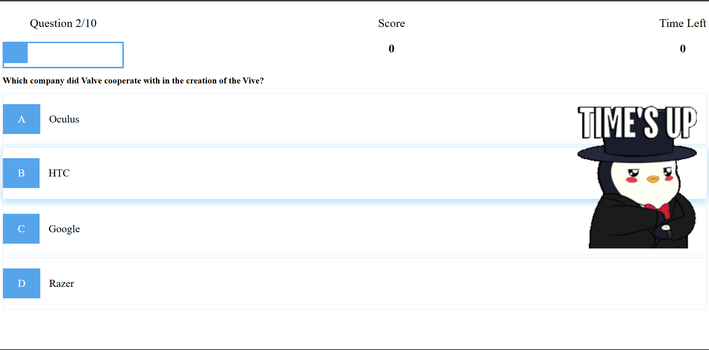
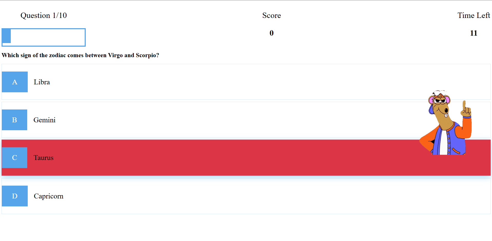
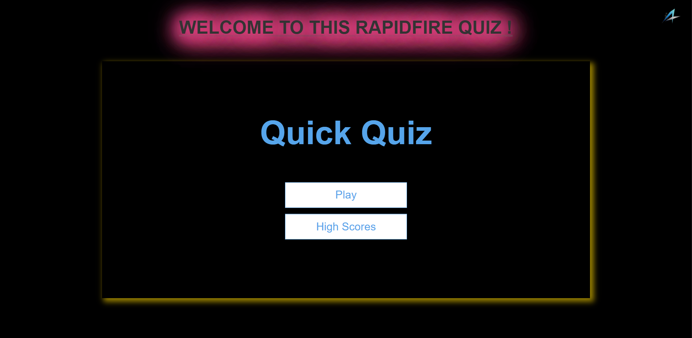

# Quizoo - Quiz App

Welcome to **Quizoo**, a fun and interactive quiz website where you can challenge yourself with random questions! The app fetches a fresh set of **10 easy multiple-choice trivia questions** from the [Open Trivia Database](https://opentdb.com/) each time you start a new session. Test your knowledge, track your score, and keep coming back for a new challenge!

## Features

- **Dynamic Question Generation**: Each quiz session pulls 10 new random questions from the Open Trivia Database API, ensuring that you never play the same quiz twice.
- **Multiple Choice Questions**: Each question comes with multiple answer options, but only one correct answer.
- **Score Tracking**: At the end of each quiz, your score is displayed based on how many questions you answered correctly.
- **Simple and Clean Interface**: The interface is intuitive and easy to navigate. Play the quiz on any device with a modern web browser (mobile, tablet, or desktop).
- **Category & Difficulty**: Currently, the app fetches questions from the "General Knowledge" category with **easy** difficulty.

## Demo

> _Include a link to a live demo here (if applicable) or upload a screenshot of your app in action._



## Tech Stack

- **Frontend**: HTML, CSS, JavaScript
- **API**: Fetches random quiz questions from the [Open Trivia Database API](https://opentdb.com/api.php?amount=10&category=9&difficulty=easy&type=multiple).
- **Design**: The app is designed to be fully responsive, meaning it works seamlessly on both desktop and mobile browsers.

## How to Use

### 1. **Clone the Repository**

To get started with the Quizoo app, clone the repository to your local machine:

```bash
git clone https://github.com/iapoorv01/Quizoo.git

cd Quizoo
```

### 2. **Run the App Locally**

Since **Quizoo** is a front-end-only website, you can simply open the `index.html` file in your browser.

- Open the `index.html` file in any modern web browser (Chrome, Firefox, Safari, etc.).

If you prefer to use a local server for development purposes, you can use Python's built-in server (if you have Python installed):

```bash
# For Python 3.x:
python -m http.server

# For Python 2.x:
python -m SimpleHTTPServer
```

Once the server is running, open your browser and visit `http://localhost:8000` (or the default port) to access the app.

### 3. **Play the Quiz**

- **Start the quiz** by clicking the **"Start Quiz"** button.
- The app will fetch **10 random trivia questions** and display them one by one.
- Choose the correct answer from the multiple-choice options.
- After completing the quiz, your score will be displayed based on the number of correct answers.

## How It Works

1. **Question Fetching**:
   - The app fetches questions from the [Open Trivia Database API](https://opentdb.com/api.php?amount=10&category=9&difficulty=easy&type=multiple).
   - The API provides random trivia questions, and the app pulls 10 easy questions from the "General Knowledge" category.

2. **Answering the Questions**: 
   - Each question is presented with multiple answer choices. The user must select the correct one.
   
3. **Scoring**:
   - The app tracks your score, which is calculated based on how many correct answers you give.
   - Your final score is displayed at the end of the quiz.


Example:


## Contributing

We welcome contributions to improve **Quizoo**! Here’s how you can contribute:

1. **Fork the repository** and create a new branch for your feature or fix.
2. **Make your changes** and test them locally.
3. **Submit a Pull Request** with a description of what you've done.

## License

This project is licensed under the MIT License - see the [LICENSE](LICENSE) file for details.

## Acknowledgements

- **Open Trivia Database**: The trivia questions are fetched from the amazing [Open Trivia Database](https://opentdb.com/), which provides free access to a wide variety of trivia questions.
- Inspiration for the app design came from a desire to create a simple, fun, and interactive quiz experience for users of all knowledge levels.

---

### Key Details:
- **Dynamic Questions**: Every time the quiz starts, **10 new questions** are fetched from the Open Trivia Database API. This ensures that each quiz session is unique.
- **General Knowledge**: The questions are from the **General Knowledge** category with **easy** difficulty.
- **No Backend**: Since it’s a front-end-only application, no server or database is required. The app runs entirely in your browser.

-
